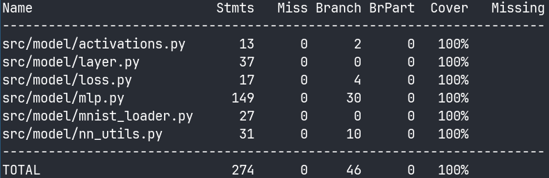

# Testing Report

In addition to the neural network this project includes a small web application. The web app is however just aimed at offering an interface for the user to see the model in action. It has therefore been left out of the scope of automatic testing.

## Automatic Testing

Test coverage for the model:


To run automatic tests, go to the project root and use

```bash
poetry run pytest src
```

To get a coverage report in your terminal, run the following from the project root:

```bash
poetry run coverage run --branch -m pytest src
poetry run coverage report -m
```

### Unit tests

Unit tests are implemented in `/src/model/tests/`.
Most files in this directory are dedicated to unit tests.
The only exception is the file named `/src/model/tests/integration_test.py`,
which contains integration tests. More on those in the next section.

Unit tests aim to verify that each function and method behaves as expected.
Since we are working with vectors and matrices, lots of tests aim to ensure that return values of different functions have the correct shape.
These tests also ensure that the right values get printed to the console when expected, that files are being saved when they should, and that numpy arrays are getting updated.

### Integration Tests

Integration tests are implemented in `/src/model/tests/integration_test.py`.
The goal with these tests is to go beyond individual methods and functions, and to test the network as a whole.
This [article](https://www.sebastianbjorkqvist.com/blog/writing-automated-tests-for-neural-networks/) by Sebastian Björkqvist was a big help in implementing integration tests.

These tests were implemented by generating a sample of 16 digits, training the network on them, and asserting that the network learns as expected.

There are 3 types of integration tests:

- overfitting a small dataset: to ensure that the model learns effectively, we should be able to achieve 100% prediction accuracy on a small dataset
- ensuring that the loss function score decreases during training: the parameters should get updated in a manner that minimizes the loss function output
- asserting that each training cycle updates all layers: every layer should be updated during a training cycle, since if one layer is left out for some reason, learning speed is very likely to be diminished

## Performance in Training

I collected training durations for different layer structures. The results follow.

5 attempts for each layer structure. Stochastic gradient descent. Used 15 epochs:

| Layer structure     | Training time                 |
| ------------------- | ----------------------------- |
| [784, 512, 256, 10] | Between 60.7 and 68.3 seconds |
| [784, 512, 128, 10] | Between 46.2 and 64.5 seconds |
| [784, 256, 128, 10] | Between 24.8 and 31.2 seconds |

As I suspected while writing about time complexity in my project specification,
training time decreases significantly when reducing the size of the first hidden layer.
The reason is that the heaviest matrix multiplications happen at the first hidden layer,
given that the input layer, which is typically the largest, feeds into it.
